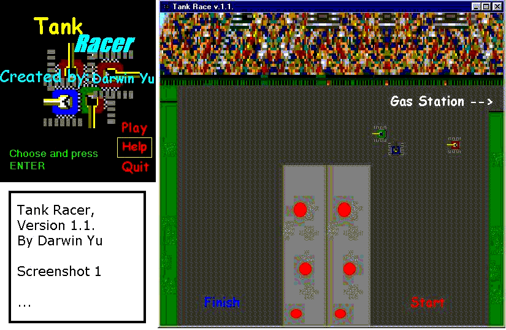



## A TankRace game in VB\! No joke\! Check out screenshot\!

### Description

A tank racing game in VB! Guide race tank against 2 other computer players! Featuring collision detection, one track, crash scenes, and more! Check it out! Small zip file, worth your time. However, the computer players were made to only drive through this track. Making new tracks require(but no hard) heavy modifications. Basically, I had nothing to do and created this in a few minutes. Yes, there are(to some of you) a lot of timers. You may change that, but I wanted things to happen at different intervals, and squeezed as much as I can as each timer can do. If you like this game, a vote will be appreciated. If not, then please don't vote poorly.

Enjoy...
 
### More Info
 

             |
---                |---
**Submitted On**   |2001-07-21 17:26:00
**By**             |[LordsOfGames](https://github.com/Planet-Source-Code/PSCIndex/blob/master/ByAuthor/lordsofgames.md)
**Level**          |Beginner
**User Rating**    |3.7 (41 globes from 11 users)
**Compatibility**  |VB 5\.0, VB 6\.0
**Category**       |[Games](https://github.com/Planet-Source-Code/PSCIndex/blob/master/ByCategory/games__1-38.md)
**World**          |[Visual Basic](https://github.com/Planet-Source-Code/PSCIndex/blob/master/ByWorld/visual-basic.md)
**Archive File**   |[A TankRace232257212001\.zip](https://github.com/Planet-Source-Code/lordsofgames-a-tankrace-game-in-vb-no-joke-check-out-screenshot__1-25305/archive/master.zip)

